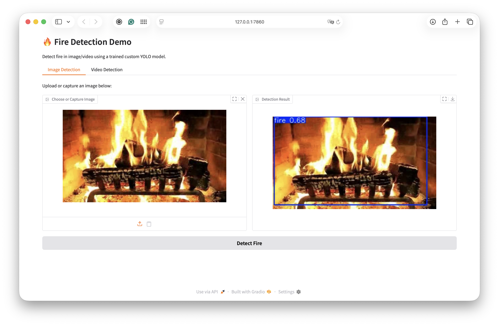
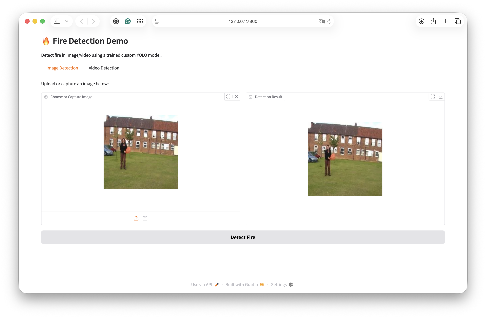
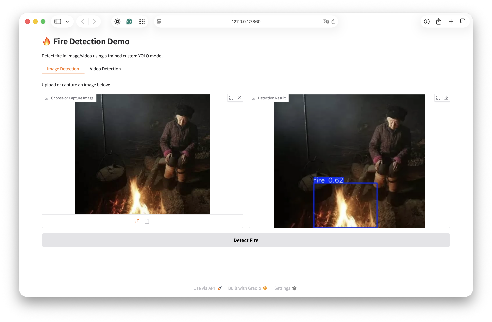

# Fire Detection with YOLOv11 (Custom Dataset)

This is a personal project focused on developing a fire detection system using a custom YOLOv11 model trained on a self-prepared dataset.

## Dataset

The dataset was collected and annotated using Roboflow. 
It consists of over 2700 images showing fire in various scenarios. 
The dataset was split into training, validation, and test sets in a 70%-20%-10% ratio, and then exported in YOLOv11 format.

## Model Training

The training was done using YOLOv11 Nano (`yolov11n.pt`) as the base model. 
The model was trained for 15 epochs. Due to limited computational resources, the results are modest but sufficient for demonstration purposes. At the last epoch, the metrics were approximately:

- mAP@0.5: 0.35  
- mAP@0.5:0.95: 0.16  
- Precision: 0.42  
- Recall: 0.37  

These numbers indicate that the model can detect fire, though it is not highly precise yet. With more data or longer training, the accuracy could be improved.

## Gradio Demo

A Gradio interface was created to showcase the model. It allows users to:

- Upload or capture images for fire detection.  
- Upload videos or use webcam input to detect fire in video frames.

### Screenshots

#### Image Detection

  
  
  

#### Video Demo

[Video Demo](demo/video1.mp4)
